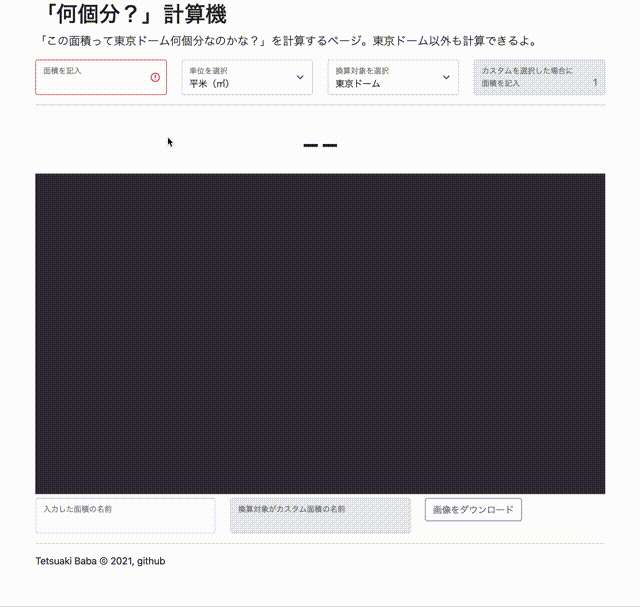

# 「何個分？」計算機
「この面積って東京ドーム何個分なのかな？」を計算するページ。東京ドーム以外やカスタム選択機能もあるよ．出来上がった画像は「画像をダウンロード」ボタンを押して保存できるよ．

## DEMO
以下のリンクからお試しください。
  * https://tetsuakibaba.github.io/HowManyHogeHogeAreThere

## Compatibility
  * Any major browsers (chrome, safari, firefox)

## Author
* Tetsuaki Baba: https://tetsuakibaba.jp
* Affiliation: Tokyo Metropolitan University

## Reference
  * p5js libraries: https://p5js.org/libraries/
  * Bootstrap: https://getbootstrap.com