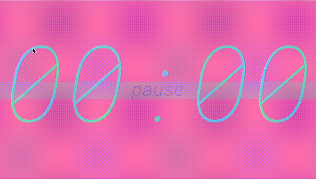
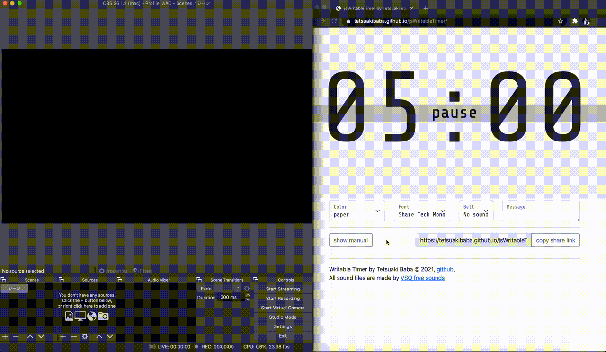
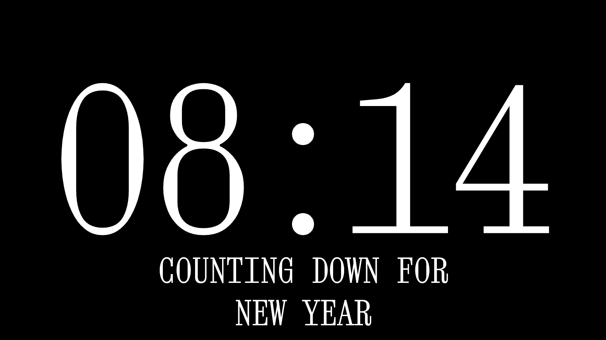

# jsWritableTmer

## Desctiption
This is an application that allows you to write one stroke of a number to input a timer.

## Demo

* Try at github page: https://tetsuakibaba.github.io/jsWritableTimer/

## How to use jsWritableTimer with OBS

  * https://www.youtube.com/watch?v=147w_jFvK5c&feature=youtu.be
  * https://tetsuakibaba.github.io/jsWritableTimer/#manual_obs

## Gallery
The color scheme and fonts are customizable. The image below are examples.

## Usage
Please read the manual on the demo page.

## Author
* Tetsuaki Baba: https://tetsuakibaba.jp

## Reference
  * p5js libraries: https://p5js.org/libraries/
  * Bootstrap: https://getbootstrap.com
  * $1 Unistroke Recognizer: http://depts.washington.edu/acelab/proj/dollar/index.html